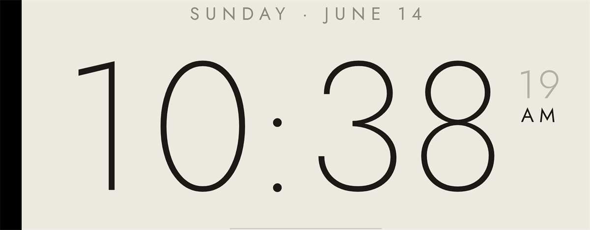
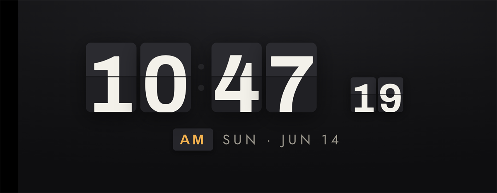
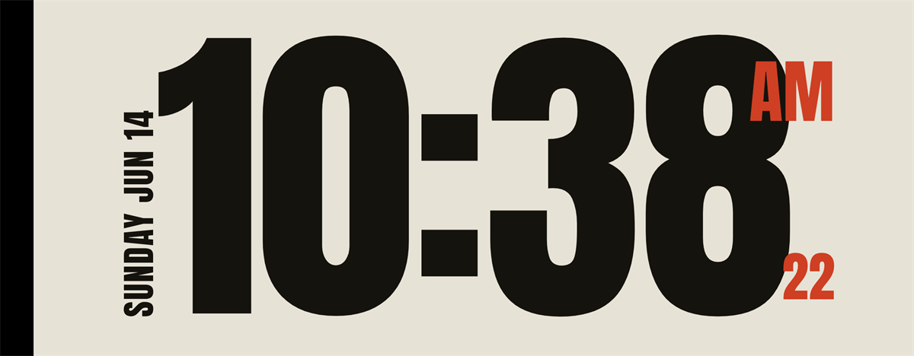
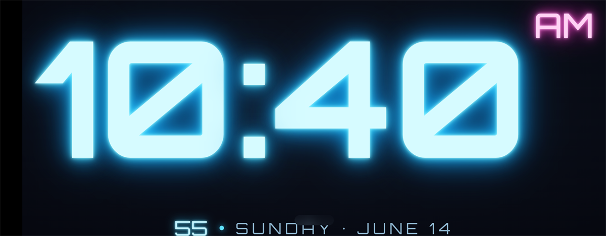

# Desk Clock 🕐

여러 시계 페이스를 넘기며 보는 **미니멀 탁상시계**. 브라우저에서 바로 쓸 수 있는 웹앱이자, 네트워크 없이 동작하는 **오프라인 Android 앱(APK)** 으로 빌드됩니다.

화면을 **터치하면 다음 시계로 전환**되고, 선택한 페이스는 다음에 다시 켜도 유지됩니다. 전체화면·다크 대응으로 책상 위 상시 디스플레이(예: 폴드 커버 화면)에 잘 어울립니다.

## 시계 페이스

아래 캡처는 갤럭시 Z 폴드5 **커버 화면(가로 2316×904)** 에서 찍은 것입니다.

### 1. Minimal — 미니멀
얇은 Jost 서체의 따뜻한 페이퍼 톤. 날짜·초·AM/PM을 곁들인 단정한 구성.



### 2. Retro Flip — 레트로 플립
접혔다 펴지는 split-flap 애니메이션의 기계식 플립 시계.



### 3. Typography — 타이포그래피
Anton 대형 활자의 에디토리얼 포스터. 세로 날짜와 버밀리언 포인트.



### 4. Neon — 네온
Orbitron 서체에 시안/마젠타 글로우를 입힌 네온사인 시계.



## 주요 기능

- **4가지 시계 페이스** — 화면 터치(또는 ← / → 키)로 순환 전환
- **선택 유지** — 마지막 페이스를 `localStorage`에 저장해 재실행 시 복원
- **전체화면** — 상태바·내비게이션바를 숨긴 몰입형(immersive) 모드
- **화면 꺼짐 방지** — 상시 켜두는 탁상시계용으로 화면이 자동으로 꺼지지 않음
- **완전 오프라인** — 폰트까지 앱에 내장해 네트워크 없이 동작
- **광폭 화면 대응** — 폴드 커버 화면 같은 초광폭 비율에서 콘텐츠를 키워 화면을 채움

## 구조

```
app/                 웹앱 본체 (= Capacitor webDir)
  index.html         4개 페이스 + 틱/전환/저장 로직 (단일 파일)
  fonts/             내장 폰트 (Jost·Archivo·Orbitron 가변 + Anton, woff2)
  manifest.json      PWA 매니페스트
android/             Capacitor가 생성한 네이티브 Android 프로젝트
docs/DESIGN.md       페이스별 상세 디자인 사양서
screenshots/         위 캡처 이미지
```

웹 버전은 `app/index.html`을 그대로 정적 호스팅하면 됩니다. (별도 공개 데모는 precipi.com 의 데모 목록에 포함)

## Android APK 빌드

[Capacitor](https://capacitorjs.com/) 기반입니다. **Node.js**, **JDK 17+**, **Android SDK**가 필요합니다.

```bash
npm install                       # 의존성 설치
npx cap copy android              # app/ 의 웹 에셋을 네이티브로 복사
cd android && ./gradlew assembleDebug
# 산출물: android/app/build/outputs/apk/debug/app-debug.apk
```

웹 에셋(`app/`)을 수정한 뒤에는 `npx cap copy android`로 다시 동기화하세요.

### 기기에 설치 (사이드로딩)

디버그 APK는 자체 서명되어 바로 사이드로딩할 수 있습니다. USB로 연결 후:

```bash
adb install -r android/app/build/outputs/apk/debug/app-debug.apk
```

> 디버그 빌드는 개인 사이드로딩/테스트용입니다. 스토어 배포에는 릴리스 서명이 별도로 필요합니다.

## 기술 노트

- **전체화면·배경**: 액티비티 테마를 `AppTheme.NoActionBar`(검정 배경)로 두고, `MainActivity`에서 `WindowInsetsControllerCompat`로 시스템 바를 숨기고 `FLAG_KEEP_SCREEN_ON`을 적용.
- **오프라인 폰트**: Google Fonts를 링크하지 않고 woff2를 `@font-face`로 내장. (오프라인에서 플립 숫자 정렬이 깨지던 문제 해결)
- **서비스워커 없음**: 번들 앱에서는 에셋이 이미 로컬이라 SW가 불필요하고 stale 캐시만 유발하므로 제거.

페이스별 색상·간격·애니메이션 등 상세 사양은 [docs/DESIGN.md](docs/DESIGN.md)를 참고하세요.
